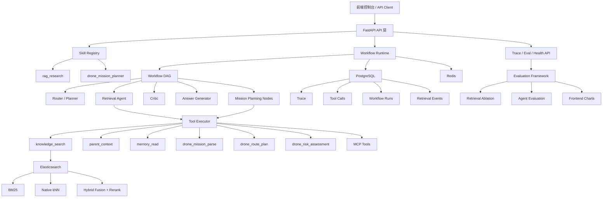

# RAG Agent Decision System

一个面向 **RAG 检索增强、Agent Workflow 编排、Skill/MCP 工具化扩展、评测可视化与生产化部署** 的完整工程项目。

项目不仅实现了文档问答，还把 Agent 能力抽象为可复用的 Skill、Tool 和 Workflow。当前内置了知识库问答、业务任务规划等示例能力，用于展示一个 Agent 平台如何从检索系统扩展到具体业务任务。

## 核心能力

- 文档解析、chunk 生成、父子 chunk 建模与元数据增强
- Elasticsearch BM25 + 原生 kNN 向量检索
- Hybrid Search、候选融合、Cross-Encoder Rerank
- Deterministic Agent、LLM Planner、LLM Critic、LLM Answer Generator
- 可配置 Workflow DAG，支持 Parallel / Merge 策略
- Tool Registry 与 MCP 风格工具调用
- Skill Registry，将业务能力封装为可执行入口
- PostgreSQL 持久化 trace、tool_calls、retrieval_events、workflow_runs
- Redis 会话记忆与长期记忆
- 检索消融实验与 Agent 端到端评测
- 中文前端控制台，支持评测集与指标图表可视化
- Docker、health check、preflight、smoke test、API Key 鉴权与工具 scope 权限控制

## 项目架构



## 技术亮点

### 1. 真实 Hybrid RAG 检索链路

系统使用 Elasticsearch 同时承载 BM25 和 dense vector 检索，支持：

- BM25 关键词检索
- Elasticsearch 原生 kNN 查询
- Hybrid candidate fusion
- Cross-Encoder Rerank
- 元数据增强排序
- 父子 chunk 上下文扩展

当前 RFC 数据集包含约：

```text
rfc_chunks.jsonl              1467 chunks
rfc_parent_child_chunks.jsonl 3314 parent/child chunks
```

### 2. 父子 Chunk 与元数据增强

索引中同时保留 parent chunk 和 child chunk：

- child chunk 用于细粒度召回
- parent chunk 用于回答时补充上下文
- metadata 保存 `source_file`、`source_url`、`rfc_number`、`section`、`title`、`offset`、`chunk_role`

这种设计兼顾召回精度与回答完整性。

### 3. 可配置 Agent Workflow

Workflow 通过 JSON 配置定义节点和边：

```text
router -> retrieval_original + retrieval_rewritten -> merge_evidence -> critic -> answer
```

支持：

- 条件路由
- 并行检索
- Merge 去重与加权
- Critic 反思
- 最大迭代次数控制
- Workflow node run 持久化

### 4. Skill / Tool / MCP 分层设计

项目将 Agent 能力拆成三层：

```text
Skill    -> 面向业务的能力入口
Workflow -> 可配置执行图
Tool     -> 可审计、可权限控制的确定性能力
```

内置 Skill：

```text
rag_research             文档知识库问答
drone_mission_planner    无人机任务规划
```

工具统一通过 Tool Registry 注册，并使用 scope 做权限隔离：

```text
retrieval
memory
planning
mission
external
```

### 5. 无人机任务规划业务示例

`drone_mission_planner` 展示了如何把平台扩展到真实业务：

```text
自然语言任务
  -> 任务解析
  -> 地图上下文
  -> 禁飞区检查
  -> 天气约束
  -> 航线规划
  -> 风险评估
  -> 人工审批用任务计划
```

示例输入：

```text
明天上午 9 点让两架无人机巡检 A 区域的输电线路，重点检查杆塔和疑似异物。
```

输出内容包括任务类型、作业区域、无人机数量、巡检目标、航线策略、每架无人机的航程和载荷、风险等级、缓解措施和安全边界。

安全边界：当前只生成 `review_only_json` 和审批说明，不会直接下发飞控命令。

### 6. Trace 与可观测性

系统将 Agent 执行过程持久化到 PostgreSQL：

- `workflow_runs`
- `workflow_node_runs`
- `tool_calls`
- `retrieval_events`
- `chat_tasks`
- `user_feedback`

这使每次 Agent 输出都可以回放：

```text
用户问题
-> Workflow 节点执行
-> Tool 调用参数
-> 检索结果
-> Rerank 分数
-> 最终回答
```

### 7. 评测与可视化

内置两套评测集：

```text
app/eval/dataset.jsonl        16 cases
app/eval/dataset_large.jsonl  60 cases
```

支持评测：

- BM25 only
- Vector only
- Hybrid no rerank
- Hybrid + rerank
- Hybrid + rerank + metadata adjustment
- Agent workflow evaluation

默认评测集上已有结果：

```text
hybrid_rerank Recall@5          100.00%
hybrid_rerank MRR@10             85.63%
hybrid_rerank CitationAccuracy   75.00%
ToolSuccessRate                 100.00%
```

前端控制台可展示：

- 数据集来源分布
- gold chunk 数量分布
- answer keyword 数量分布
- Recall@5 / MRR@10 / CitationAccuracy / ToolSuccessRate 图表
- Agent 端到端评测指标

## 目录结构

```text
app/
  api/                 FastAPI 路由
  core/                配置、安全、生命周期
  db/                  PostgreSQL models 和连接
  eval/                评测集与评测指标
  services/            RAG、Agent、Workflow、Memory、Trace 服务
  static/              前端控制台
  tools/               Tool Registry 与业务工具

config/
  skills/              Skill 配置
  workflows/           Workflow DAG 配置
  mcp_servers/         MCP server 配置

data/
  raw/                 原始文档
  parsed/              chunk JSONL

docs/                  架构、排障、生产化、业务方案文档
reports/               评测报告
scripts/               数据处理、入库、评测、smoke、preflight 脚本
skills/                Codex-style skill 本体
```

## 快速启动

创建环境文件：

```powershell
Copy-Item .env.example .env
```

安装依赖：

```powershell
python -m venv .venv
.\.venv\Scripts\Activate.ps1
pip install -r requirements.txt
```

启动基础设施：

```powershell
docker compose up -d
```

初始化数据库：

```powershell
python scripts/upgrade_db.py
```

启动 API：

```powershell
uvicorn app.main:app --reload --host 0.0.0.0 --port 8000
```

打开控制台：

```text
http://localhost:8000/app/
```

打开 API 文档：

```text
http://localhost:8000/docs
```

## 数据处理与入库

将 `.txt`、`.md` 或 `.pdf` 文件放入 `data/raw` 后执行：

```powershell
python scripts/chunk_dataset.py --input-dir data/raw --output data/parsed/chunks.jsonl
```

索引到 Elasticsearch：

```powershell
python scripts/index_chunks.py --input data/parsed/rfc_chunks.jsonl --batch-size 64 --recreate
```

检索测试：

```powershell
python scripts/search_chunks.py "How does TLS 1.3 prevent replay attacks?" --top-k 5
```

## 运行 Skill

执行 RAG Research：

```powershell
curl.exe -X POST "http://localhost:8000/skills/rag_research/run" `
  -H "Content-Type: application/json" `
  -d "{\"question\":\"What is QUIC?\",\"session_id\":\"demo\"}"
```

执行无人机任务规划：

```powershell
curl.exe -X POST "http://localhost:8000/skills/drone_mission_planner/run" `
  -H "Content-Type: application/json" `
  -d "{\"question\":\"明天上午 9 点让两架无人机巡检 A 区域的输电线路，重点检查杆塔和疑似异物。\",\"session_id\":\"drone_demo\"}"
```

## 评测

运行默认评测报告：

```powershell
python scripts/run_eval_report.py --output reports/eval_report.md
```

生成并运行更大评测集：

```powershell
python scripts/generate_large_eval_dataset.py --max-cases 60
python scripts/run_eval_report.py --dataset app/eval/dataset_large.jsonl --output reports/eval_report_large.md
```

跳过 Agent 评测，仅运行检索评测：

```powershell
python scripts/run_eval_report.py --dataset app/eval/dataset_large.jsonl --output reports/eval_report_large_retrieval.md --no-agent-eval
```

查看数据集摘要：

```text
GET /eval/dataset?name=default&sample_size=12
GET /eval/dataset?name=large&sample_size=12
```

## 生产化检查

运行 preflight：

```powershell
python scripts/preflight.py
```

运行 smoke test：

```powershell
python scripts/smoke_api.py --strict-ready
```

使用 Docker 启动 API：

```powershell
docker compose --profile api up -d --build
```

## 安全设计

- API Key 可选鉴权
- Tool scope 权限隔离
- Skill 执行入口受控
- Workflow condition 使用白名单解释器，不使用 Python `eval`
- 高风险业务工具只生成审批计划，不直接执行物理世界动作
- Trace、tool_calls、workflow_runs 持久化，便于审计

## 文档

- [Agent 设计](docs/agent_design.md)
- [多 Agent Workflow 设计](docs/multi_agent_design.md)
- [Skill / MCP 设计](docs/skill_mcp_design.md)
- [安全设计](docs/security_design.md)
- [生产化说明](docs/production_readiness.md)
- [前端控制台说明](docs/frontend_console.md)
- [无人机任务规划方案](docs/drone_mission_planning.md)
- [面试排障记录](docs/interview_debug_notes.md)

## 当前状态

这是一个可本地运行、可评测、可扩展业务 Skill 的 RAG Agent 工程项目。后续可继续增强：

- 引入 Alembic 数据库迁移
- 增加 Prometheus metrics
- 接入真实地图、天气、禁飞区 API
- 将无人机任务规划接入审批系统
- 增加更多多跳问答和业务评测集
