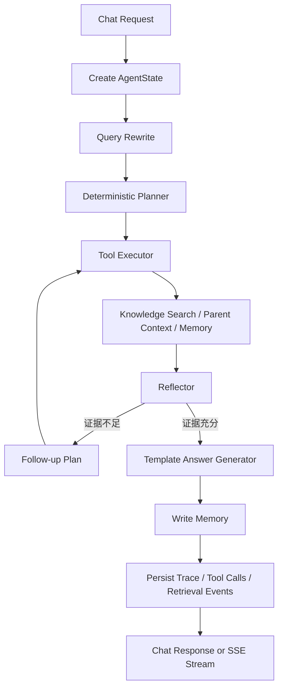

# Agent 架构设计

## 0. 当前设计更新：Supervisor 路由驱动

当前项目已经从“所有任务都进入完整 Multi-Agent 流程”修正为 Router-driven Workflow Graph。

统一入口 `agent_supervisor` 会先判断任务类型和复杂度：

- 简单概念解释：进入 `direct_answer`
- 手册、规范、RFC 查询：进入 RAG Skill 分支
- 链路预算、覆盖估计、路径损耗：进入确定性工具分支
- 复杂无人机任务规划：进入 Mission Planner / Tool Executor / Constraint Verifier 闭环

这样保留了 Workflow Graph 的可观测性、trace 和扩展性，同时避免低复杂度任务被过度编排。详细设计见 `docs/supervisor_workflow_design.md`。

## 1. 目标

当前版本实现的是一个不依赖 LLM 的 deterministic Agent。它的目标不是生成最自然的回答，而是把 Agent 项目的核心工程链路跑通：

- 有明确的状态对象 `AgentState`
- 有可解释的 Planner / Executor / Reflector / Generator 分层
- 有工具注册、参数校验、超时和重试
- 有 RAG 检索、父子 chunk 上下文、短期记忆
- 有 trace、tool_calls、retrieval_events 的持久化
- 有可评测、可消融、可排障的运行闭环

## 2. 执行流程



## 3. 核心模块

| 模块 | 文件 | 作用 |
| --- | --- | --- |
| 状态 | `app/services/agent/state.py` | 保存一次 Agent 运行中的问题、计划、证据、工具调用、反思结果和最终答案 |
| 规划 | `app/services/agent/planner.py` | 基于规则识别任务类型，并生成工具调用计划 |
| 执行 | `app/services/agent/executor.py` | 执行工具，记录 latency、success、output_summary，并把输出写回 AgentState |
| 反思 | `app/services/agent/reflector.py` | 判断证据是否足够，不足时生成 follow-up query |
| 生成 | `app/services/agent/generator.py` | 基于检索证据和父 chunk 上下文生成确定性答案 |
| 编排 | `app/services/agent/orchestrator.py` | 串联 query rewrite、plan、execute、reflect、answer、memory、trace |
| 工具注册 | `app/tools/registry.py` | 集中声明工具名、schema、handler、timeout、retry |

## 4. AgentState 设计

`AgentState` 是 Agent 的运行时上下文。它让每一步都可以被追踪和复现：

- `trace_id`: 一次请求的唯一链路 ID
- `session_id`: 会话 ID，用于短期记忆
- `question`: 原始问题
- `rewritten_query`: 改写后的检索 query
- `task_type`: 规则分类得到的任务类型
- `plan`: Planner 生成的工具调用步骤
- `tool_calls`: 每个工具的参数、耗时、成功状态和摘要
- `retrieval_events`: 检索 query、top_k、召回 chunk 和分数
- `evidence`: 最终参与回答的 child chunks
- `parent_contexts`: 父 chunk 上下文
- `reflections`: 每轮反思结果
- `final_answer`: 最终答案

## 5. 工具层设计

工具通过 `ToolSpec` 注册：

```python
ToolSpec(
    name="knowledge_search",
    description="Search the indexed knowledge base.",
    input_model=KnowledgeSearchInput,
    handler=knowledge_search,
    timeout_seconds=90.0,
    retry_count=0,
)
```

这样做的原因：

- 工具白名单清晰，避免 Planner 随便调用未知函数
- 每个工具都有 Pydantic input schema，参数错误会在执行前暴露
- timeout 和 retry 是工具级别配置，不同工具可以有不同策略
- 后续接入 LLM Planner 时，可以直接把 registry 转成 tool schema
- 面试时可以清楚解释 Agent 的工具调用不是 if-else 拼接，而是一个可扩展 runtime

当前工具：

| 工具 | 作用 |
| --- | --- |
| `knowledge_search` | 调用 ES BM25 / native kNN / hybrid / rerank 检索知识库 |
| `parent_context` | 根据 child chunk 的 `parent_id` 拉取父 chunk 上下文 |
| `memory_read` | 从 Redis 读取会话短期记忆 |
| `web_search` | 预留的外部搜索工具接口 |
| `plan_generator` | 预留的确定性规划生成工具 |

## 6. 反思机制

当前 Reflector 是规则型：

- 没有 evidence 时，判定失败并触发 follow-up search
- evidence 没有 `parent_id` 时，判定上下文不足
- compare 类型任务如果只检索到单一文档，触发补充检索
- 其余情况认为证据足够

这不是 LLM self-reflection，但它已经具备 Agent loop 的关键结构：执行、检查、补救、再执行。

## 7. Trace 与可观测性

每次运行会持久化：

- `chat_tasks`: 请求、答案、任务类型、trace_id
- `tool_calls`: 工具名、参数、输出摘要、成功状态、耗时
- `retrieval_events`: query、召回 chunk、分数、耗时
- `user_feedback`: 用户反馈和问题标签

这部分的价值是可复盘。面试时可以讲：我不仅实现了 Agent 调用链，还把每次工具调用和检索事件落库，因此可以做失败分析、评测归因和后续在线优化。

## 8. 当前限制与下一步

当前 Agent 仍然是 deterministic 版本，限制包括：

- Planner 依赖规则，复杂任务拆解能力有限
- Generator 是抽取式模板回答，表达能力有限
- Reflector 只做规则检查，不能深层判断答案质量
- `web_search` 和 `plan_generator` 仍是预留接口

下一步可以升级为：

- LLM Planner: 根据 tool registry 自动选择工具
- LLM Answer Generator: 基于 evidence 生成更自然的引用式回答
- Tool fallback: 工具失败时走备用检索策略
- Guardrail: 对工具参数、外部请求和答案引用做更严格校验
- Evaluation loop: 将 trace 中的失败样本自动沉淀为回归测试集

## 9. 客户端生命周期管理

当前服务已经接入 FastAPI lifespan：

```text
app/core/lifespan.py
```

统一关闭：

```text
AsyncElasticsearch retriever client
Redis async memory client
SQLAlchemy engine
```

关闭入口：

```python
await close_app_resources()
```

FastAPI 服务启动时通过：

```python
FastAPI(..., lifespan=lifespan)
```

自动在 shutdown 阶段释放资源。

这样可以避免 RAG workflow 测试后出现：

```text
Unclosed client session
Unclosed connector
```

脚本侧也统一使用：

```python
await retriever.close()
```

而不是直接访问 `retriever.client.close()`。

为支持同一进程中的多次测试启停，ES 和 Redis 客户端采用 lazy client 方式：

```text
首次访问时创建
shutdown 时 close 并置空
下一次访问时自动重建
```

## 10. 记忆系统

当前记忆系统分为两层：

```text
Redis 短期记忆
PostgreSQL 长期记忆
```

短期记忆：

- 保存最近 20 条 session message
- TTL 为 24 小时
- 用于当前会话上下文

长期记忆：

- 表：`long_term_memories`
- 字段：`session_id / memory_type / content / importance / source_trace_id / meta / created_at`
- 每次 workflow 完成后，会自动把 question + answer 沉淀为 `conversation_summary`
- 也可以通过 `POST /memory` 手动写入

MemoryAgent 读取时会同时返回：

```text
short_term_messages
long_term_memories
```

当前长期记忆检索采用 PostgreSQL session 过滤 + 简单关键词匹配 + importance 排序。后续可以升级为向量化长期记忆。
