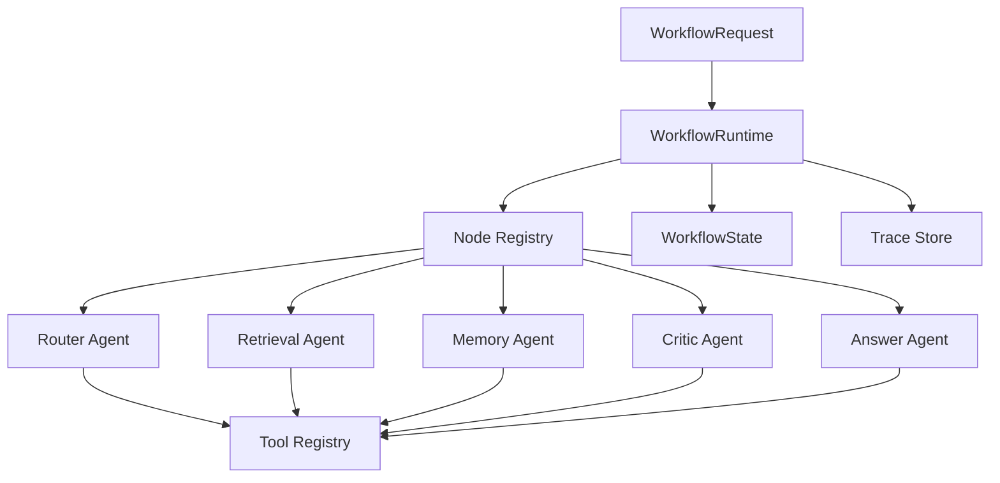

# 多 Agent 模式设计：借鉴 FastGPT Workflow

## 0. 当前实现取舍

当前项目没有把所有请求都强制送入完整 Multi-Agent 链路，而是采用 Supervisor 路由驱动的 Workflow Graph。

这意味着 Multi-Agent 是复杂任务的一条分支，而不是所有任务的默认入口。简单问题直接回答，规范查询调用 RAG Skill，链路预算调用确定性 Tool，复杂无人机任务规划才进入多节点任务规划闭环。

这个设计比“多个 Agent 无差别轮流执行”更适合面试表达：它能解释清楚任务分流、失败隔离、工具权限、trace 回放和评测边界。

## 1. 设计目标

可以模仿 FastGPT，但建议模仿它的 workflow 思想，而不是只模仿页面形态。

FastGPT 的核心是把复杂 AI 应用拆成可连接的节点。节点类似函数或 API endpoint，通过输入、输出和触发关系组成流程。workflow 从 Start 节点触发，节点根据前驱状态执行或跳过，直到没有节点继续运行。

本项目可以把这个思想后端化，设计成一个可配置的 Multi-Agent DAG：

- Agent 是一种特殊节点
- Tool 是 Agent 可调用的能力
- Workflow 是多个 Agent / Tool / Condition / Merge 节点组成的有向图
- Runtime 负责调度、并发、状态传递、失败隔离和 trace 落库

## 2. 为什么不是简单“多个 Agent 聊天”

面试里不建议把 multi-agent 讲成几个角色互相对话，例如 Planner Agent、Research Agent、Writer Agent 轮流发消息。这样很难解释：

- 谁决定下一个 Agent 是否执行
- 中间状态如何结构化传递
- 一个 Agent 失败是否影响整体
- 如何评测每个 Agent 的贡献
- trace 如何定位问题

更好的设计是 workflow graph：

```text
Start -> Router -> RetrievalAgent -> EvidenceJudge -> AnswerAgent -> End
                  \-> WebAgent ------/
```

每个节点都有输入、输出、运行状态和边条件，所有执行记录都能落库。

## 3. FastGPT 思想到本项目的映射

| FastGPT 概念 | 本项目映射 | 说明 |
| --- | --- | --- |
| Workflow Start | `start` 节点 | 接收用户问题、session_id、top_k |
| AI Chat Node | `agent` 节点 | Planner / Retriever / Critic / Answerer |
| Knowledge Base Search | `tool` 节点或 RetrievalAgent | 调用已有 ES 检索和 rerank |
| Question Classification | `router` 节点 | 决定走 RAG、记忆、规划、比较等路径 |
| Conditional IF/ELSE | `condition` 节点 | 根据结构化状态判断分支 |
| Parallel Run | `parallel` 节点 | 多个子 Agent 并发执行 |
| Knowledge Base Search Merge | `merge` 节点 | 合并多个检索结果或多个 Agent 输出 |
| Code Run | `code` 节点 | 后续可接安全沙箱，目前先不做 |
| Custom Feedback | `feedback` 节点 | 复用已有 user_feedback 表 |

## 4. 核心架构



### 4.1 WorkflowDefinition

用于描述一条多 Agent 流程：

```json
{
  "workflow_id": "rag_multi_agent_v1",
  "nodes": [
    {"id": "start", "type": "start"},
    {"id": "router", "type": "agent", "agent_type": "router"},
    {"id": "retrieve", "type": "agent", "agent_type": "retriever"},
    {"id": "critic", "type": "agent", "agent_type": "critic"},
    {"id": "answer", "type": "agent", "agent_type": "answerer"}
  ],
  "edges": [
    {"from": "start", "to": "router"},
    {"from": "router", "to": "retrieve", "condition": "route == 'rag'"},
    {"from": "retrieve", "to": "critic"},
    {"from": "critic", "to": "answer", "condition": "passed == true"},
    {"from": "critic", "to": "retrieve", "condition": "passed == false"}
  ]
}
```

### 4.2 WorkflowState

区别于当前单 Agent 的 `AgentState`，多 Agent 需要更通用的状态：

```text
workflow_run_id
session_id
question
variables
node_outputs
active_nodes
completed_nodes
failed_nodes
trace_events
iteration
```

其中：

- `variables`: 全局变量，例如 rewritten_query、route、top_k
- `node_outputs`: 每个节点的结构化输出
- `active_nodes`: 当前可执行节点
- `trace_events`: 每个节点的输入、输出、耗时、状态

### 4.3 NodeSpec

所有节点都走统一协议：

```python
class NodeSpec:
    node_type: str
    input_model: BaseModel
    output_model: BaseModel
    handler: Callable
    timeout_seconds: float
    retry_count: int
```

这和当前 `ToolSpec` 思路一致。区别是 Tool 是 Agent 内部能力，Node 是 workflow 调度单位。

## 5. 建议的 Agent 角色

### 5.1 RouterAgent

职责：

- 判断问题类型：RAG、记忆查询、方案生成、比较分析、越界问题
- 生成 route 和必要参数

输入：

```text
question, session_id
```

输出：

```text
route, rewritten_query, required_agents
```

### 5.2 RetrievalAgent

职责：

- 调用 `knowledge_search`
- 拉取 parent context
- 输出 evidence package

输入：

```text
query, top_k, retrieval_mode, rerank_enabled
```

输出：

```text
evidence, parent_contexts, retrieval_events
```

### 5.3 MemoryAgent

职责：

- 读取 Redis 短期记忆
- 后续可扩展为 PostgreSQL 长期记忆

输入：

```text
session_id
```

输出：

```text
memory_messages, memory_summary
```

### 5.4 CriticAgent

职责：

- 检查证据是否足够
- 检查是否需要补充检索
- 给出 follow-up query

输入：

```text
question, evidence, parent_contexts
```

输出：

```text
passed, reason, followup_queries
```

### 5.5 AnswerAgent

职责：

- 基于 evidence 和 parent context 生成最终答案
- 输出 citations

输入：

```text
question, evidence, parent_contexts, memory_summary
```

输出：

```text
answer, citations, confidence
```

## 6. 多 Agent 执行模式

### 6.1 Sequential

适合当前主链路：

```text
Router -> Retrieval -> Critic -> Answer
```

优点是可控、容易 debug。

### 6.2 Conditional Branch

适合不同任务类型：

```text
Router
  -> RAG path
  -> Memory path
  -> Plan generation path
  -> Out-of-scope reply
```

### 6.3 Parallel

模仿 FastGPT Parallel Run，但在后端实现：

```text
Router -> Parallel(
  RetrievalAgent(query_original),
  RetrievalAgent(query_rewritten),
  MemoryAgent(session_id)
) -> Merge -> Critic -> Answer
```

关键约束：

- 每个并行分支必须隔离变量
- 每个分支单独记录 success / error / latency
- 汇总节点只消费结构化输出
- 并发数要配置上限

### 6.4 Loop

模仿 FastGPT Batch / loop 思想：

```text
Retrieval -> Critic
Critic failed -> Retrieval(followup_query)
Critic passed -> Answer
```

需要限制：

- `max_iterations`
- `max_tool_calls`
- `max_total_latency_ms`

## 7. 数据库设计补充

已有：

- `chat_tasks`
- `tool_calls`
- `retrieval_events`
- `user_feedback`

建议新增：

### 7.1 workflow_runs

```text
id
workflow_id
trace_id
session_id
question
status
started_at
finished_at
final_answer
error_message
```

### 7.2 workflow_node_runs

```text
id
workflow_run_id
node_id
node_type
agent_type
status
input_json
output_json
error_message
latency_ms
started_at
finished_at
```

### 7.3 workflow_edges

如果 workflow definition 存数据库：

```text
workflow_id
from_node
to_node
condition_expr
```

MVP 阶段也可以先把 workflow definition 写成 Python dict / YAML 文件，不急着入库。

## 8. API 设计

新增接口：

```text
POST /workflows/run
POST /workflows/stream
GET  /workflows/{workflow_run_id}
GET  /workflows/{workflow_run_id}/nodes
```

请求：

```json
{
  "workflow_id": "rag_multi_agent_v1",
  "session_id": "default",
  "question": "What does HTTP 404 mean?",
  "top_k": 5
}
```

响应：

```json
{
  "workflow_run_id": "...",
  "trace_id": "...",
  "answer": "...",
  "citations": [],
  "node_runs": []
}
```

## 9. 实现顺序

### 第一阶段：后端 MVP

当前已完成：

1. 新增 `app/services/workflow/state.py`
2. 新增 `app/services/workflow/definition.py`
3. 新增 `app/services/workflow/runtime.py`
4. 新增 `app/services/workflow/nodes.py`
5. 把当前 deterministic Agent 能力拆成 Router / Memory / Plan / Retrieval / Critic / Answer 节点
6. 提供一个内置 workflow：`rag_multi_agent_v1`
7. 新增 API：`POST /workflows/run`
8. API 返回 `node_runs`，底层工具调用继续复用已有 `tool_calls` 和 trace 持久化

MVP 当前边界：

- `WorkflowDefinition` 已经包含 nodes 和 edges
- Runtime 已经基于 edges 推进节点，并支持当前需要的 condition expression
- node_runs 已经持久化到 `workflow_node_runs`
- parallel / merge 节点尚未实现
- streaming workflow 尚未实现

已验证链路：

```text
plan_generation:
router -> plan -> critic -> answer

document_qa:
router -> retrieval_original + retrieval_rewritten -> merge_evidence -> critic -> answer
```

condition MVP 支持：

```text
==
in
and
or
true / false
```

为了安全，当前没有使用 Python `eval` 执行 condition。

### 第二阶段：并行与合并

当前已完成：

1. RAG 路径从单 retrieval 节点升级为两个并行 retrieval 分支
2. `retrieval_original` 使用原始问题检索
3. `retrieval_rewritten` 使用 rewritten query 检索
4. 两个分支各自使用独立 branch state，避免并发写同一个 `AgentState.evidence`
5. `merge_evidence` 负责去重、按 score 排序、写回主 AgentState
6. 并行分支和 merge 节点都进入 `workflow_node_runs`

已验证：

```text
NODES=router,retrieval_original,retrieval_rewritten,merge_evidence,critic,answer
TOOLS=knowledge_search,parent_context,knowledge_search,parent_context
CITATIONS=3
```

### 第三阶段：可配置化

1. workflow definition 从 YAML 或数据库加载
2. 支持 condition 表达式
3. 支持在 API 中选择 workflow_id
4. 支持 workflow 级别评测和消融

## 10. 面试讲法

可以这样讲：

> 我没有把 multi-agent 做成几个 prompt 互相聊天，而是借鉴 FastGPT 的 workflow/node 思想，把 Agent 抽象成 DAG 中的节点。每个节点都有输入输出 schema、超时、重试和 trace。Runtime 负责根据边条件调度节点，支持顺序、条件、并行和 loop。这样每个 Agent 的贡献可以单独评测，也能定位失败来自路由、检索、反思还是生成。

这个说法比“我做了 Planner Agent、Retriever Agent、Writer Agent”更工程化，也更接近真实生产系统。

## 11. 当前实现状态

目前已经完成：

- `POST /workflows/run`: 普通 workflow 执行
- `POST /workflows/stream`: SSE 流式 workflow 执行
- `GET /workflows/{workflow_run_id}`: 查询 workflow 运行详情
- `GET /workflows`: 列出已加载 workflow definition
- `POST /workflows/reload`: 重新加载 workflow 配置
- DAG edges 驱动调度
- condition 白名单解释器
- `workflow_runs` / `workflow_node_runs` 持久化
- RAG 并行检索分支：`retrieval_original` + `retrieval_rewritten`
- `merge_evidence` 统一去重、排序和写回主状态
- 可选 LLM Planner / LLM Critic / LLM Answer Generator

Streaming 事件类型：

```text
workflow_start
node_start
node_done
node_failed
workflow_done
workflow_error
```

已验证链路：

```text
plan_generation:
router -> plan -> critic -> answer

document_qa:
router -> retrieval_original + retrieval_rewritten -> merge_evidence -> critic -> answer
```

下一步建议：

- 给 parallel 节点加并发上限和分支失败策略
- 增加 workflow 级别评测和消融
- 做一个简单调试页面展示 node_runs 和 streaming events

## 13. Workflow 可配置化

当前 workflow definition 已经从纯 Python 硬编码迁移到 JSON 配置：

```text
config/workflows/rag_multi_agent_v1.json
```

加载流程：

```text
内置 BUILTIN_RAG_MULTI_AGENT_V1 作为 fallback
扫描 config/workflows/*.json
解析 nodes / edges / max_iterations
校验 workflow_id、节点唯一性、边引用合法性
同名 JSON definition 覆盖内置 definition
```

这样做的原因：

- 配置损坏时仍有内置 fallback
- 修改 workflow 不需要改 Python 代码
- 可以通过 `POST /workflows/reload` 在服务运行中重新加载
- 便于后续迁移到数据库或可视化编辑器

配置示例：

```json
{
  "workflow_id": "rag_multi_agent_v1",
  "max_iterations": 2,
  "nodes": [
    {"node_id": "router", "node_type": "agent", "agent_type": "router"}
  ],
  "edges": [
    {"from_node": "router", "to_node": "plan", "condition": "task_type == 'plan_generation'"}
  ]
}
```

已验证：

```text
GET /workflows -> rag_multi_agent_v1 node_count=8 edge_count=12
POST /workflows/run plan path -> router,plan,critic,answer
POST /workflows/run RAG path -> router,retrieval_*,merge_evidence,critic,answer
POST /workflows/reload -> 200
unknown workflow_id -> 404
```

## 12. LLM Agent 模式

当前 workflow request 支持三个开关：

```json
{
  "use_llm_planner": true,
  "use_llm_critic": true,
  "use_llm_answer": true
}
```

默认值都是 `false`，因此系统仍然保持 deterministic 可运行。开启后：

- Router 节点调用 LLM Planner，输出 `task_type`、`route`、`rewritten_query` 和 plan
- Critic 节点调用 LLM Critic，输出 `passed`、`reason`、`followup_queries`
- Answer 节点调用 LLM Answer Generator，基于 evidence 生成引用式回答

本地默认 provider 是 mock：

```text
LLM_PROVIDER=mock
```

真实调用 OpenAI-compatible API 时配置：

```text
LLM_PROVIDER=openai
LLM_MODEL=gpt-4o-mini
LLM_BASE_URL=https://api.openai.com/v1
OPENAI_API_KEY=...
```

实现上没有新增 OpenAI SDK 依赖，而是复用已有 `httpx` 调用 Chat Completions API，方便兼容 OpenAI-compatible 服务。
## 14. Parallel / Merge 高级策略

当前并行策略配置在触发并行分支的节点上，例如 `router.config.parallel_policy`：

```json
{
  "max_concurrency": 2,
  "failure_strategy": "continue_on_error",
  "min_success": 1
}
```

Merge 策略配置在 merge 节点上：

```json
{
  "source_nodes": ["retrieval_original", "retrieval_rewritten"],
  "top_k_source": "request",
  "dedupe_key": "chunk_id",
  "score_weights": {
    "retrieval_original": 1.0,
    "retrieval_rewritten": 1.0
  }
}
```

策略含义：

- `max_concurrency`: 同时执行的分支上限
- `failure_strategy`: `fail_fast` 或 `continue_on_error`
- `min_success`: 至少多少个分支成功才允许继续
- `source_nodes`: merge 消费哪些上游分支输出
- `top_k_source`: 使用请求里的 `top_k` 或配置里的固定 `top_k`
- `dedupe_key`: 当前按 `chunk_id` 去重
- `score_weights`: 对不同分支的分数做权重调整

失败策略：

- `continue_on_error`: 分支失败会写入 failed node_run，只要成功分支数达到 `min_success` 就继续 merge
- `fail_fast`: 当前实现为 fail-after-join，会等待已启动分支收束并记录 node_run，然后整体失败，避免取消任务造成资源泄漏

已验证：

```text
正常 RAG:
router,retrieval_original,retrieval_rewritten,merge_evidence,critic,answer

部分失败 continue_on_error:
missing_handler failed
retrieval_original success
merge_evidence success

fail_fast:
返回 500
无 ES unclosed client warning
```
