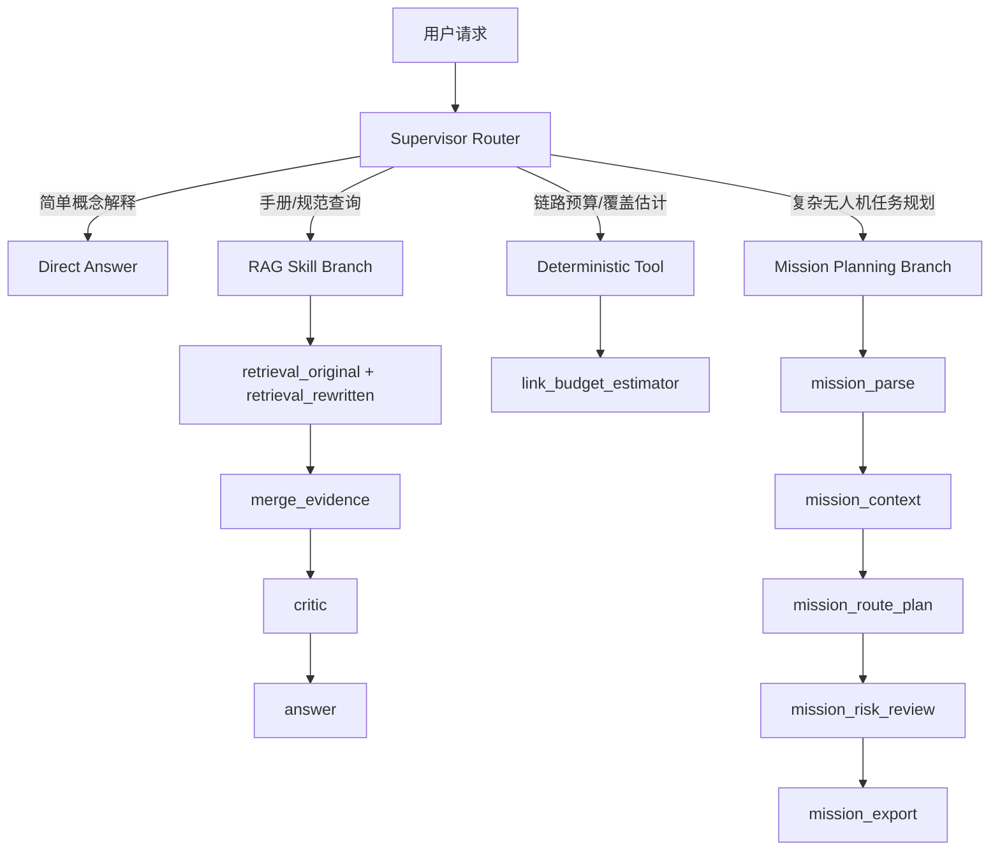

# Supervisor 路由驱动 Workflow 设计

## 1. 设计结论

当前项目采用 Router-driven Workflow Graph，而不是让所有任务都走完整 Multi-Agent 链路。

核心判断是：Multi-Agent 适合复杂任务规划，但不适合所有问题。简单概念解释、手册规范查询和确定性计算如果都强行进入 Mission Planner / Critic / Verifier 闭环，会增加延迟、成本和不确定性。

## 2. 路由策略

统一入口是 `agent_supervisor` Skill，对应 `supervisor_workflow_v1`。

## 3. 各路径说明

| 路径 | 适用任务 | 代表节点 | 设计原因 |
| --- | --- | --- | --- |
| Direct Answer | 简单概念解释 | `direct_answer` | 避免为低复杂度问题调用检索和多节点编排 |
| RAG Skill | 手册、规范、RFC、知识库查询 | `retrieval_original`、`retrieval_rewritten`、`merge_evidence`、`critic`、`answer` | 需要证据、引用和父子 chunk 上下文 |
| Deterministic Tool | 链路预算、覆盖估计、路径损耗 | `deterministic_tool`、`link_budget_estimator` | 可计算问题优先使用可解释公式，减少模型幻觉 |
| Mission Planning | 无人机巡检、航线规划、禁飞区和风险校验 | `mission_parse` 到 `mission_export` | 复杂业务任务需要多阶段结构化推理和约束校验 |

## 4. 为什么 RAG 设计成 Skill 更合理

RAG 不是所有 Agent 的内置步骤，而是一种可复用业务能力：

- 可以作为独立 Skill 暴露给外部调用
- 可以被 Supervisor 路由调用
- 可以作为复杂 Workflow 中的一个子能力
- 评测、trace、权限和配置可以独立演进

这样比把 RAG 写死在每个 Agent 内部更清晰，也更接近生产系统中的能力编排方式。

## 5. 为什么不是“所有任务完整 Multi-Agent”

全量 Multi-Agent 的问题：

- 简单问题延迟变高
- 节点越多，失败点越多
- 每个 Agent 贡献难以评测
- 确定性任务被 LLM 处理会降低可解释性
- trace 虽然丰富，但噪声变多

当前方案保留了 Workflow Graph 的优势：每个节点仍然有输入、输出、状态、耗时和错误记录；同时通过 Supervisor 让不同任务走最小必要路径。

## 6. 当前实现位置

| 内容 | 文件 |
| --- | --- |
| Supervisor workflow 配置 | `config/workflows/supervisor_workflow_v1.json` |
| Supervisor Skill | `config/skills/agent_supervisor.json` |
| 无人机 Skill 接入 Supervisor | `config/skills/drone_mission_planner.json` |
| 路由节点与确定性节点 | `app/services/workflow/nodes.py` |
| Workflow 运行时终止节点和输入适配 | `app/services/workflow/runtime.py` |
| 链路预算工具 | `app/tools/link_budget.py` |
| Tool Registry 注册 | `app/tools/registry.py` |
| MCP 工具声明 | `config/mcp_servers/local_agent_tools.json` |

## 7. 面试表达

可以这样讲：

> 我没有把系统设计成所有请求都走完整 Multi-Agent，而是做了一个 Supervisor 路由驱动的 Workflow Graph。Supervisor 会先判断任务复杂度：简单概念直接回答，规范查询调用 RAG Skill，链路预算调用确定性 Tool，只有复杂无人机任务规划才进入 Mission Planner、Tool Executor、Constraint Verifier 闭环。这样既保留了工作流的可观测性和可扩展性，又避免过度编排，提高稳定性和效率。
